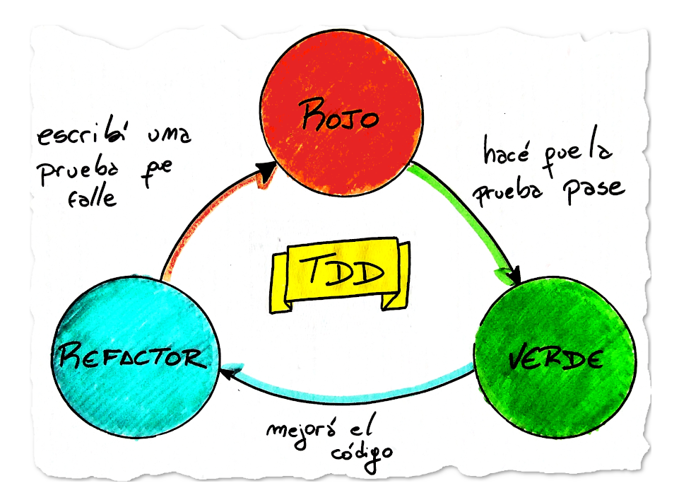
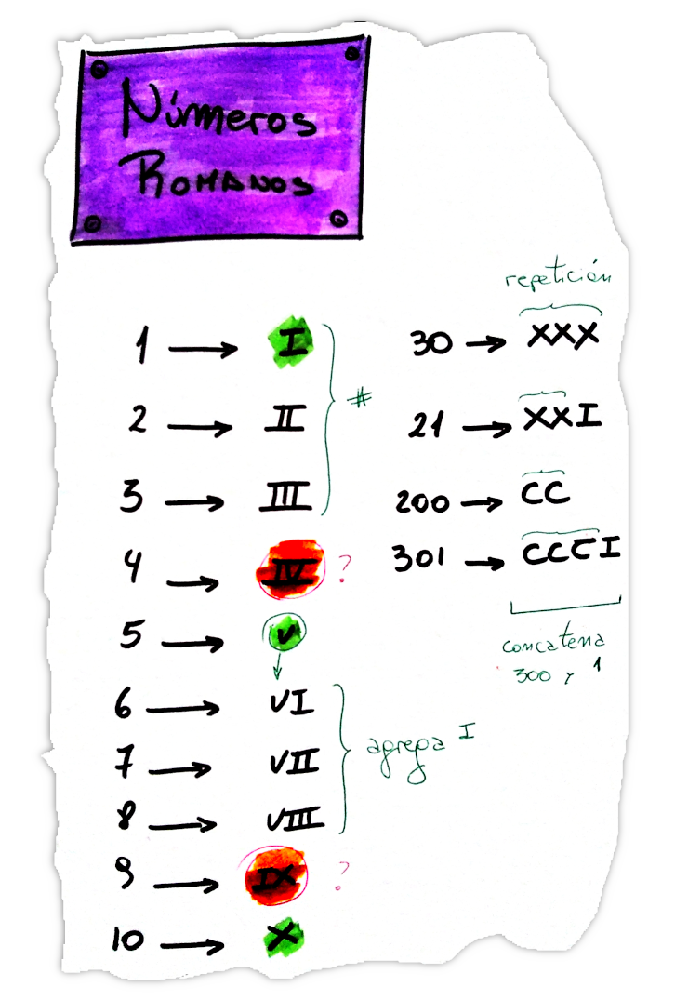
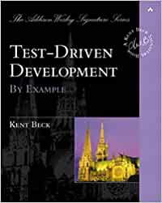

Algoritmos y Programación 2 - UNTREF

# TDD - Test-Driven Development

# Ejercicio: Números Romanos

# Clases

* [Clase TDD: Teoría](https://youtu.be/VhZnumVLLho)

* [Clase TDD: Práctica](https://youtu.be/q7xolenPBb8)

## Bibliografía

* Kent Beck, Test-Driven Development: By Example, Addison-Wesley, 2003

## Referencias

* [Kent Beck](https://es.wikipedia.org/wiki/Kent_Beck)

* [Roman Numerals Kata](https://kata-log.rocks/roman-numerals-kata)

